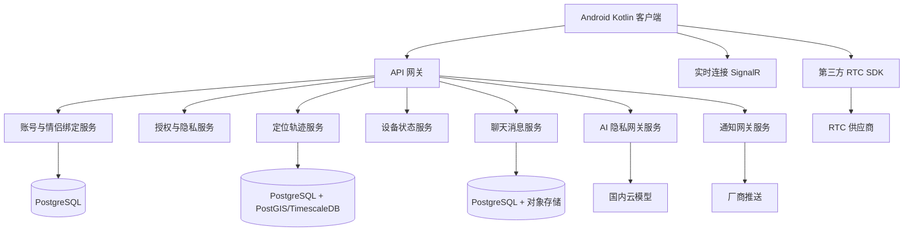

# 总体架构设计

## 架构目标

本项目是一个只服务已绑定情侣的异地恋 App。系统不做大厅、不做多人社交、不做陌生人匹配。所有核心能力围绕一对情侣的共享状态、沟通、陪伴和双方透明授权展开。

架构目标：

- 移动端体验稳定，弱网下可用。
- 敏感权限可解释、可撤回、可降级。
- 服务端边界清楚，便于微服务拆分和后续扩展。
- AI 可处理隐私数据，但必须通过专门的隐私网关。
- 文档是唯一事实源，代码必须服从设计文档和功能文档。

## 总体分层

## 客户端边界

Android 客户端负责：

- 注册登录、情侣绑定、授权管理。
- 展示聊天、音视频入口、定位轨迹、设备状态、AI 结果。
- 本机权限申请和权限说明。
- 本机数据采集：位置、电量、充电状态、用机状态、Wi-Fi 连接状态、App 打开事件、通话状态。
- 离线缓存和失败重试。

Android 客户端不得：

- 绕过系统权限采集数据。
- 使用无障碍或悬浮窗做强制控制。
- 在未授权时上传敏感数据。
- 直接调用 AI 模型服务。

## 服务端边界

服务端采用受控微服务，不做过度拆分。首版服务：

- 账号服务：手机号、微信登录、会话、注销。
- 情侣绑定服务：邀请码、绑定、解绑、关系状态。
- 授权隐私服务：每类敏感数据的双方授权、撤回、版本记录。
- 定位轨迹服务：分钟级轨迹、30 天保留、查询和删除。
- 设备状态服务：电量、充电、Wi-Fi、App 打开、用机状态、通话状态。
- 聊天服务：只允许绑定情侣互发文本、图片、语音消息。
- RTC 网关服务：签发第三方音视频 token，处理回调和审计。
- AI 隐私网关服务：所有涉及隐私数据的 AI 调用唯一入口。
- 通知网关服务：OPPO 及后续厂商推送适配。
- 审计后台服务：权限、AI、解绑、删除等敏感操作审计。

## AI 隐私网关

`AiPrivacyGateway` 是所有处理情侣隐私数据的产品 AI 调用唯一入口。

业务服务不得直接调用模型 SDK。业务服务必须依赖 AI 隐私网关，AI 隐私网关通过 `Microsoft.Extensions.AI.IChatClient` 调用国内云模型。

AI 数据流：

1. 用户主动发起 AI 分析。
2. 网关校验情侣绑定有效。
3. 网关校验双方均已授权 AI 分析。
4. 网关校验每个请求的数据类型都被双方授权。
5. 网关校验时间范围：默认 7 天，最长 30 天。
6. 网关只拉取被请求、被授权的最小必要数据。
7. 网关在内存中构造提示词，做脱敏和压缩。
8. 网关通过 `IChatClient` 调用模型。
9. 网关解析严格 JSON 输出。
10. 网关只保存双方共同可见的 AI 结果。
11. 网关只记录审计元数据。

## 存储规则

允许保存：

- AI 结果摘要。
- AI 建议列表。
- 双方可见用户 ID。
- AI 结果过期时间。
- 审计元数据。

禁止保存：

- prompt 原文。
- 模型输入快照。
- 审计日志里的聊天原文。
- 审计日志里的精确定位点。
- 审计日志里的 Wi-Fi 名称。
- 审计日志里的用机明细。

## 运行时现状

当前已实现 .NET 10 类库 `src/AIAPP.AiPrivacy`，用于承载 AI 隐私网关核心规则。后续 ASP.NET Core 服务可以通过 Minimal APIs 暴露接口，但路由层必须保持很薄，业务规则继续留在核心库。
