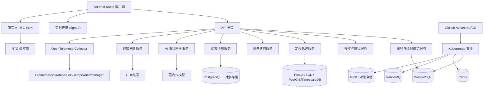

# 总体架构设计

## 架构目标

本项目是一个只服务已绑定情侣的异地恋 App。系统不做大厅、不做多人社交、不做陌生人匹配。所有核心能力围绕一对情侣的共享状态、沟通、陪伴和双方透明授权展开。

架构目标：

- 移动端体验稳定，弱网下可用。
- 敏感权限可解释、可撤回、可降级。
- 服务端边界清楚，便于微服务拆分和后续扩展。
- AI 可处理隐私数据，但必须通过专门的隐私网关。
- 文档是唯一事实源，代码必须服从设计文档和功能文档。
- 工程规范体系约束后续代码生成、全链路日志、可观测性和预警。

## 总体分层

## 8 条业务主线

系统可以按 8 条主线理解。初学者可以先不用记服务名，只要理解“谁负责什么”。

### 1. 账号绑定

用户怎么用：

- 用户用手机号登录，也可以绑定微信登录。
- 一方生成绑定码，另一方确认后成为情侣。

系统怎么处理：

- 账号服务确认用户身份。
- 情侣服务保存两个人的绑定关系。
- 后续所有情侣数据都要先检查这段关系是否有效。

涉及数据：

- 用户 ID。
- 手机号加密信息。
- 微信身份标识。
- 情侣关系 ID。
- 绑定和解绑时间。

失败时怎么办：

- 验证码错误就拒绝登录。
- 已经绑定其他人就拒绝新绑定。
- 解绑后停止新的共享和 AI 分析。

为什么这样设计：

- 这个 App 只服务一对情侣，所以情侣关系是所有功能的基础。

### 2. 授权中心

用户怎么用：

- 用户在授权隐私中心打开或关闭定位、设备状态、AI 分析等开关。

系统怎么处理：

- 授权服务保存每类数据的授权状态和版本。
- 写入敏感数据前必须检查授权。
- 任一方撤回授权，相关共享立即停止。

涉及数据：

- 授权类型。
- 授权版本。
- 授权时间。
- 撤回时间。

失败时怎么办：

- 授权缺失时不采集、不上传、不分析。

为什么这样设计：

- 这个项目不是监控工具，必须让双方知道和控制共享内容。

### 3. 聊天音视频

用户怎么用：

- 绑定情侣之间发文字、图片、语音消息。
- 双方可以发起一对一语音或视频通话。

系统怎么处理：

- 消息服务保存消息和同步状态。
- RTC 网关校验情侣关系后签发通话 token。
- 实际音视频流由第三方 RTC 供应商处理。

涉及数据：

- 消息内容。
- 图片或语音文件元数据。
- 通话邀请和通话状态。

失败时怎么办：

- 网络断开时本地排队，恢复后重试。
- RTC token 获取失败时不能进入通话。

为什么这样设计：

- 聊天是核心功能；音视频从零自建成本太高，首版用成熟供应商更稳。

### 4. 定位轨迹

用户怎么用：

- 开启位置共享后，对方可以看到当前位置和最近轨迹。

系统怎么处理：

- 客户端按权限和系统限制采集位置。
- 定位服务保存位置点，默认 30 天。
- 查询时只允许绑定情侣访问。

涉及数据：

- 经纬度。
- 时间。
- 精度。
- 用户 ID。

失败时怎么办：

- 没有前台定位就不能显示当前位置。
- 没有后台定位就只能 App 可见时更新。
- 系统省电限制会导致不是每分钟都能上传。

为什么这样设计：

- Android 后台定位有限制，必须把“分钟级轨迹”设计成目标能力，而不是绝对承诺。

### 5. 设备状态

用户怎么用：

- 双方授权后可以看到电量、充电、Wi-Fi、用机、App 打开、通话状态。

系统怎么处理：

- 客户端采集本机状态摘要。
- 设备状态服务保存当前状态和历史摘要。
- 对方查询时只看到授权范围内的状态。

涉及数据：

- 电量。
- 是否充电。
- 是否连接 Wi-Fi。
- 用机时长摘要。
- App 打开状态。
- 通话中/结束状态。

失败时怎么办：

- 没有用机访问权限就不展示用机状态。
- 读不到 Wi-Fi 名称时只显示“已连接”。
- 通话权限拒绝时不展示通话状态。

为什么这样设计：

- 设备状态用于陪伴和解释，不用于监控隐私内容。

### 6. 锁屏答题

用户怎么用：

- 用户主动开启设备管理员权限后，可以触发系统锁屏和 App 内答题任务。

系统怎么处理：

- 客户端调用系统设备管理员能力锁屏。
- 用户仍按系统方式解锁手机。
- 回到 App 后完成答题。

涉及数据：

- 是否开启设备管理员。
- 答题任务。
- 完成状态。

失败时怎么办：

- 未授权设备管理员时不能触发系统锁屏。
- 用户关闭设备管理员后功能停止。

为什么这样设计：

- 普通 App 不能合法绕过系统锁屏。使用系统设备管理员能力是更清晰的边界。

### 7. AI 分析

用户怎么用：

- 双方先分别同意 AI 使用聊天、轨迹、用机状态。
- 一方主动发起分析。
- 结果双方共同可见。

系统怎么处理：

- AI 隐私网关检查绑定、授权、数据类型和时间范围。
- 只拉取最小必要数据。
- 通过 `IChatClient` 调用国内云模型。
- 只保存 AI 输出结果，不保存输入 prompt。

涉及数据：

- 被授权的聊天摘要。
- 被授权的轨迹摘要。
- 被授权的设备状态摘要。
- AI 输出结果。
- 审计元数据。

失败时怎么办：

- 任一方未授权就失败。
- 模型超时或输出格式错误时返回可解释失败。

为什么这样设计：

- AI 会处理高敏感数据，所以必须集中经过隐私网关，不能散落在业务代码里。

### 8. 通知推送

用户怎么用：

- 用户收到消息、通话邀请、位置共享变化、AI 完成等提醒。

系统怎么处理：

- 通知网关统一处理推送。
- OPPO 首发，后续扩展华为、小米、vivo。

涉及数据：

- 推送 token。
- 通知类型。
- 通知状态。

失败时怎么办：

- 推送失败时下次打开 App 同步。
- 用户关闭通知权限时，只做 App 内提醒。

为什么这样设计：

- 国内 Android 不能只依赖 FCM，需要适配厂商推送。

## 客户端边界

Android 客户端负责：

- 注册登录、情侣绑定、授权管理。
- 展示聊天、音视频入口、定位轨迹、设备状态、AI 结果。
- 本机权限申请和权限说明。
- 本机数据采集：位置、电量、充电状态、用机状态、Wi-Fi 连接状态、App 打开事件、通话状态。
- 离线缓存和失败重试。

Android 客户端不得：

- 绕过系统权限采集数据。
- 使用无障碍或悬浮窗做强制控制。
- 在未授权时上传敏感数据。
- 直接调用 AI 模型服务。

## 服务端边界

服务端采用受控微服务，不做过度拆分。首版服务：

- 账号服务：手机号、微信登录、会话、注销。
- 情侣绑定服务：邀请码、绑定、解绑、关系状态。
- 授权隐私服务：每类敏感数据的双方授权、撤回、版本记录。
- 定位轨迹服务：分钟级轨迹、30 天保留、查询和删除。
- 设备状态服务：电量、充电、Wi-Fi、App 打开、用机状态、通话状态。
- 聊天服务：只允许绑定情侣互发文本、图片、语音消息。
- RTC 网关服务：签发第三方音视频 token，处理回调和审计。
- AI 隐私网关服务：所有涉及隐私数据的 AI 调用唯一入口。
- 通知网关服务：OPPO 及后续厂商推送适配。
- 审计后台服务：权限、AI、解绑、删除等敏感操作审计。

## 工程规范体系与可观测性

工程规范体系负责约束后续代码生成和质量门禁。

它包含：

- 中文工程规范文档。
- 功能、接口、AI 代码生成、可观测性模板。
- 文档门禁、隐私日志门禁、可观测性门禁、项目总门禁脚本。
- `AIAPP.Observability` 共享类库。

服务端全链路日志和可观测性统一使用 OpenTelemetry。每次关键操作都要能通过 `correlation_id` 串起 Android 客户端、API、数据库、消息队列、AI 模型和推送供应商。

默认观测组合：

- Prometheus：指标。
- Grafana：看板。
- Loki：日志。
- Tempo：链路追踪。
- Alertmanager：预警。

日志、Trace、Metric 和 Alert 只能使用排障元数据，不能包含聊天原文、完整经纬度、Wi-Fi 名称、手机号、验证码、token、prompt 或模型输入快照。

## 部署架构

首版部署采用 Kubernetes + kustomize。

部署配置位于 `deploy/k8s/`：

- PostgreSQL + PostGIS：核心业务数据和空间数据。
- Redis：会话、在线状态、限流、短期缓存。
- RabbitMQ：服务间事件。
- MinIO：S3 兼容对象存储。
- OpenTelemetry Collector：统一接收可观测性数据。
- Prometheus、Grafana、Loki、Tempo、Alertmanager：指标、看板、日志、链路追踪和预警。

CI/CD 使用 GitHub Actions：

- CI 负责运行项目总门禁。
- CD 采用手动触发，执行 `kubectl apply -k deploy/k8s/base`。

生产环境可以替换为云厂商托管 PostgreSQL、Redis、对象存储，但业务代码不能绑定具体云厂商。

## AI 隐私网关

`AiPrivacyGateway` 是所有处理情侣隐私数据的产品 AI 调用唯一入口。

业务服务不得直接调用模型 SDK。业务服务必须依赖 AI 隐私网关，AI 隐私网关通过 `Microsoft.Extensions.AI.IChatClient` 调用国内云模型。

AI 数据流：

1. 用户主动发起 AI 分析。
2. 网关校验情侣绑定有效。
3. 网关校验双方均已授权 AI 分析。
4. 网关校验每个请求的数据类型都被双方授权。
5. 网关校验时间范围：默认 7 天，最长 30 天。
6. 网关只拉取被请求、被授权的最小必要数据。
7. 网关在内存中构造提示词，做脱敏和压缩。
8. 网关通过 `IChatClient` 调用模型。
9. 网关解析严格 JSON 输出。
10. 网关只保存双方共同可见的 AI 结果。
11. 网关只记录审计元数据。

## 存储规则

允许保存：

- AI 结果摘要。
- AI 建议列表。
- 双方可见用户 ID。
- AI 结果过期时间。
- 审计元数据。

禁止保存：

- prompt 原文。
- 模型输入快照。
- 审计日志里的聊天原文。
- 审计日志里的精确定位点。
- 审计日志里的 Wi-Fi 名称。
- 审计日志里的用机明细。

## 运行时现状

当前已实现 .NET 10 类库 `src/AIAPP.AiPrivacy`，用于承载 AI 隐私网关核心规则。后续 ASP.NET Core 服务可以通过 Minimal APIs 暴露接口，但路由层必须保持很薄，业务规则继续留在核心库。

## P0 后端基础落地

P0 后端基础采用三个 ASP.NET Core Minimal API 服务：

- `IdentityService`：负责手机号验证码登录、微信登录适配接口、JWT access token、refresh token 哈希保存、手机号加密和哈希。
- `CoupleService`：负责长邀请码、二维码 payload、接受邀请、解绑和当前情侣关系查询。
- `ConsentService`：负责授权查询、开启授权、撤回授权和授权版本记录。

三个服务按 DDD、CQRS 和充血模型组织。PostgreSQL 首版使用单库分 schema：`identity`、`couple`、`consent`。这样能让初学者本地部署更简单，同时避免不同服务直接读写彼此表。后续如果拆成独立数据库，必须先写 ADR 和迁移方案。

所有服务必须接入 `AIAPP.Observability`、`correlation_id` 和 `/healthz`。敏感写操作采用本地审计表记录元数据，不记录手机号、验证码、token、聊天原文、精确定位、Wi-Fi 名称、prompt 或模型输入快照。
