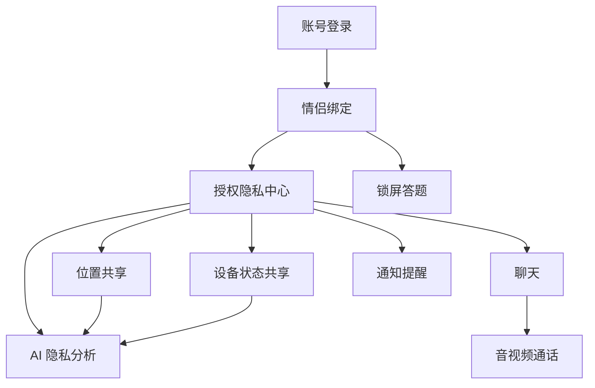

# 功能地图

## 首版功能总览

首版包含以下核心功能：

- 账号注册登录。
- 情侣绑定和解绑。
- 聊天、语音消息、图片消息。
- 语音通话和视频通话。
- 定位和分钟级行动轨迹。
- 设备状态共享。
- 锁屏答题。
- AI 隐私分析。
- 通知和提醒。
- 授权、暂停共享、撤回、删除。

## 功能优先级

P0 必须完成：

- 账号登录。
- 情侣绑定。
- 授权隐私中心。
- 聊天。
- 位置共享。
- 设备状态基础展示。
- AI 隐私分析基础版。
- OPPO 上架所需隐私说明。

P1 首版增强：

- 语音和视频通话。
- 分钟级轨迹回放。
- 锁屏答题。
- 厂商推送。
- 用机状态和 Wi-Fi 状态。

P2 后续增强：

- 情侣纪念日。
- 互动任务。
- 情绪日记。
- 更丰富的 AI 回顾。
- 多厂商应用商店适配。

## 功能依赖

## 功能文档要求

每个功能必须有独立文档，至少包含：

- 功能目标。
- 用户流程。
- 权限需求。
- 数据范围。
- 服务端 API。
- Android 采集方式。
- 失败和降级。
- 隐私说明。
- 测试场景。
- 上架审核注意事项。
