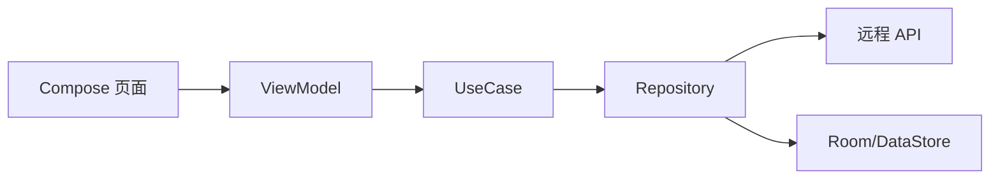

# Android 客户端设计

## 项目结构

建议采用多模块：

- `app`：应用入口和导航壳。
- `core:network`：网络、鉴权、错误处理。
- `core:database`：Room 数据库。
- `core:datastore`：本地配置。
- `core:designsystem`：Compose 主题、组件。
- `core:permissions`：权限申请和说明。
- `feature:auth`：登录注册。
- `feature:couple`：情侣绑定。
- `feature:consent`：授权隐私中心。
- `feature:chat`：聊天。
- `feature:location`：位置和轨迹。
- `feature:device`：设备状态。
- `feature:lock`：锁屏答题。
- `feature:ai`：AI 分析结果。
- `feature:call`：语音视频。
- `feature:notifications`：通知设置。

## 架构模式

每个功能模块采用：

- Compose 页面。
- ViewModel。
- UseCase。
- Repository。
- RemoteDataSource。
- LocalDataSource。

数据流：

## 权限申请策略

权限不能在启动页一次性全要。必须在用户进入具体功能时按需申请，并展示中文说明。

定位：

- 进入地图时申请前台定位。
- 开启持续共享时解释后台定位。
- 用户拒绝后允许继续使用聊天等非定位功能。

用机状态：

- 进入设备状态共享时引导开启 Usage Access。
- 未授权时展示“未开启用机共享”，不做隐藏采集。

通知监听：

- 只有在明确需要同步特定通知状态时才引导开启。
- 首版优先用服务端消息和本机状态，不默认依赖通知监听。

设备管理员：

- 只在用户开启锁屏答题时申请。
- 必须明确说明用途和关闭方式。

## 离线与重试

客户端本地保存：

- 待发送聊天消息。
- 待上传位置点。
- 待上传设备状态。
- 最近一次授权状态。

重试规则：

- 网络失败进入队列。
- 敏感数据上传前重新检查本地授权状态。
- 服务端返回授权失效时立即停止上传并清理队列中对应数据。

## 中文体验

所有用户可见文案必须中文优先。权限说明要直接说清楚：

- 要什么权限。
- 为什么需要。
- 不给权限会怎样。
- 如何关闭。

不能使用恐吓式、误导式、强迫式文案。
